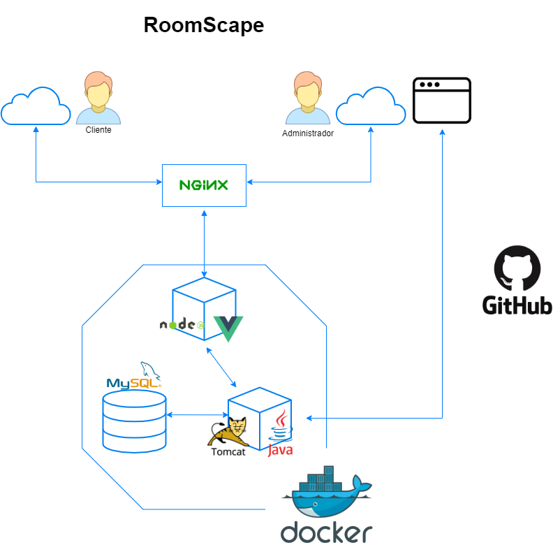

# RoomScape Prototipo (Back End)



## Requisitos

Para crear y ejecutar la aplicación, necesita:

- [JDK 11.0](https://www.oracle.com/es/java/technologies/javase-jdk11-downloads.html)
- [Maven 3](https://maven.apache.org)

## Ejecutando la aplicación localmente

Hay varias formas de ejecutar una aplicación Spring Boot en su máquina local. Una forma es ejecutar el método `main` en
la clase` roomscape.es.prototype.PrototypeApplication` desde su IDE.

Alternativamente, puede usar
el [complemento Spring Boot Maven] (https://docs.spring.io/spring-boot/docs/current/reference/html/build-tool-plugins-maven-plugin.html)
así:

```shell
mvn spring-boot:run
```

## Dependencias

### Base de Datos

La aplicación de conecta a una Base de Datos MySQL en un servidor web:

#### phpMyAdmin:

http://mysql.roomscape.es/

```shell
usuario: roomscape
password: roomscape
```

#### MySQL:

```shell
jdbc:mysql://192.168.1.56:3306/roomscape_prototype
usuario: roomscape
password: roomscape
```
